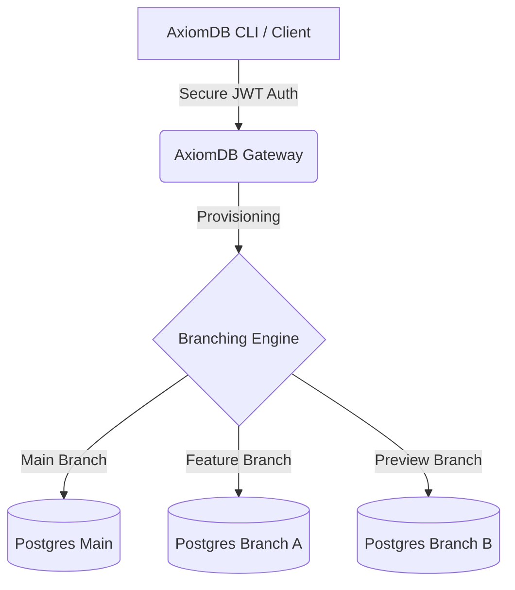

# 🌌 AxiomDB Gateway (The Backend Core)

*The absolute GOAT for multi-branch Postgres database management.*

Lowkey, managing traditional databases is an L. It's rigid, scary to touch, and testing in production is an easy way to get cancelled by your engineering team. **AxiomDB** flips the script. We bring Git-like branching to Postgres so your database workflow actually slaps. 

This repository is the **Gateway** — the backend engine that makes all the magic happen.

## 🤔 Why it Matters (No Cap)

You need branching in your database because staging environments are mid and sharing one dev DB is a vibe killer. 

| Problem | The AxiomDB Flex (W) |
| :--- | :--- |
| **Schema Changes** | Branch your data, run Prisma migrations, test safely. No fear of dropping tables fr. |
| **Collaboration** | Every dev gets their own isolated branch. No more stepping on each other's toes. |
| **Preview Deployments** | Spin up a fresh DB branch for every Vercel/Netlify preview URL. Based workflow. |
| **Performance** | Highkey blazingly fast. Written to scale without eating your RAM. |

## 🛠️ Architecture Vitals



The Gateway handles all the heavy lifting: authentication, job queues, instance provisioning, and telemetry. It's the central nervous system keeping your branches in sync.

## 🚀 Getting Started

If you're pulling up to contribute to the backend, here's how to run it locally:

```bash
# 1. Clone the repo
git clone https://github.com/squareexp/axiomdb-gateway.git
cd axiomdb-gateway

# 2. Boot up the services
cargo run
```

## 🐛 Found an Issue? (Report it)

If something's acting sus or you found a bug, don't just leave us on read. Report it so we can patch it up.
1. Open a [GitHub Issue](https://github.com/squareexp/axiomdb-gateway/issues).
2. Drop the error logs and what you were doing.
3. If it's a security flaw, DM the maintainers directly (keep it lowkey until patched).
